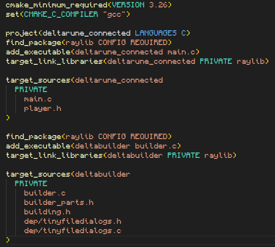
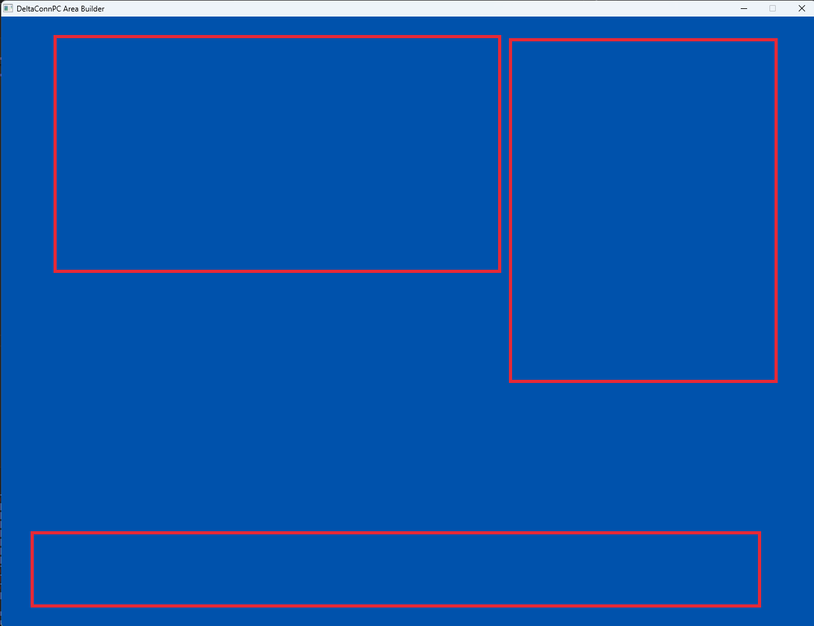

## Devlog #2 - 7/13/2026
# Building a Builder

#### Self-replication...?

So, here's where I start talking about computer science... scary!  
These devlogs are for documenting the *creation* of the software; I can't *not* talk about the coding lol.

## CMaking the Project

I'm using CMake for this project, which I had to learn because I've never used it before. I'm using it so that the project is widely compilable, which is obviously important if it is to be playable by everyone who wants to.  
Installing CMake and its dependencies was the hardest part simply because it was boring. The rest was easy to do using an online tutorial from CMake themselves. I got CMake running with SDL3, a graphics library for C. Then, I decided I wanted to use Raylib instead because I was much more experienced with it. Guess which one I'm using now...

It's Raylib. I don't know why I asked you to guess.  
Raylib is great, though, and I'd recommend it to anyone who wants to make good-looking stuff with C or C++. #nonspon #asiflol #iwish

## Getting to <u>C</u>oding

I coded the player movement for about 3 microseconds before realizing I need scenes for players to walk around in!!! This obviously meant that I need to make a level builder first. That's what I've done today, just setting up the very basics of a level editor.

Feature #1 I made was placing rectangular hitboxes. The placing and drawing of them was easy; what was hard was making them work with camera movement. For some reason, I couldn't figure it out for a good while, but it suddenly clicked after a while and I made it work perfectly.

Yeah, it works pretty well, I'm glad it didn't take very long. The next things I need to do are to make other editing modes, to add other hitbox shapes, to get image support, and to make a file-export system for the levels one builds.