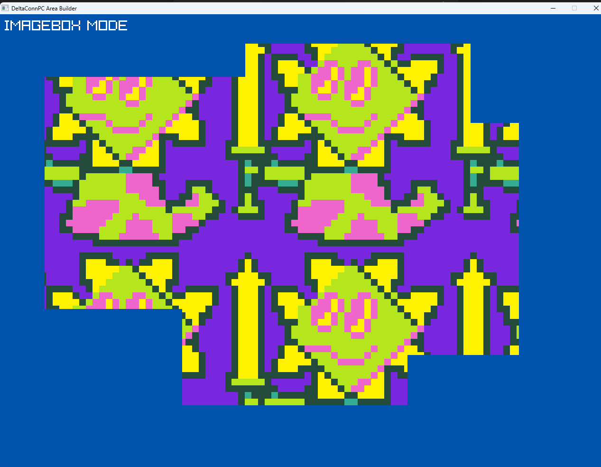
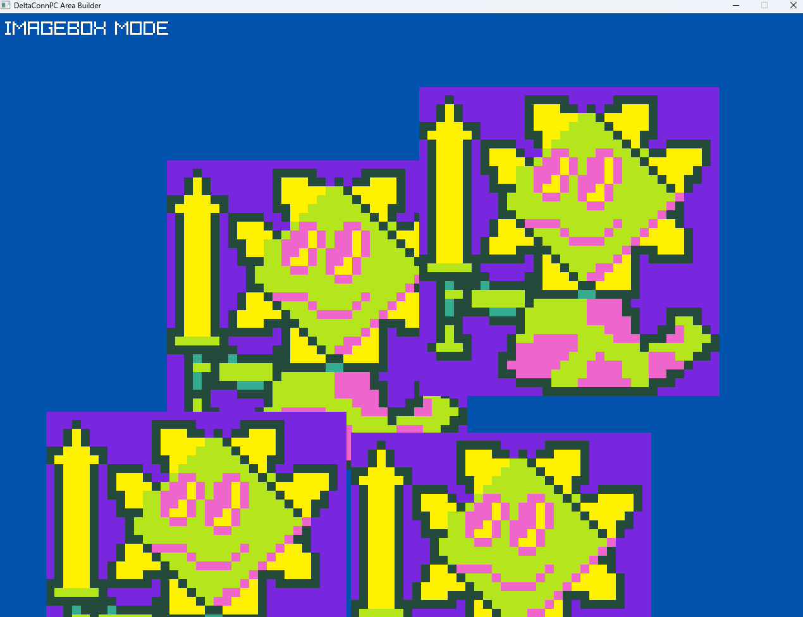
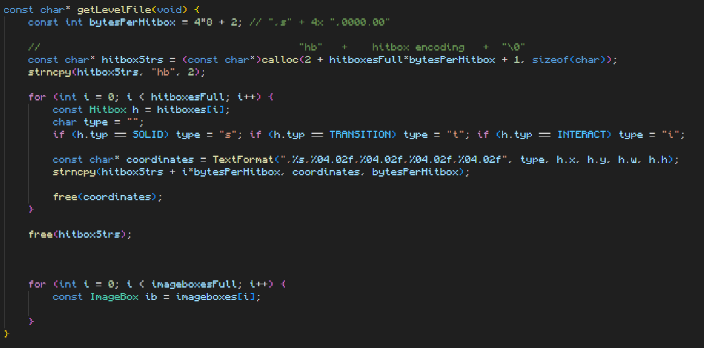

## Devlog #3 - 7/15/2026
# Another Frame on the Wall, Pt. 1

In order to make the levels look... like anything, one needs to be able to place images. So I got to work on the `ImageBox` stuff in the code.

## Texture Problems

I did a lot of coding for the images without actually testing it, most of which worked first-try! But the part that DIDN'T work first-try was the images' actual appearance. When I tried placing some, their positons were totally off-kilter and I had to figure out why.  
As it is so frequently with my code, it was a silly error that honestly makes very little sense as an attempt at all. Apparently, I had made the source rectangle of the texture the same as the DESTINATION RECTANGLE.


I- WHAT?!  
My error did cause a very interesting tiling effect, which I might want to remember for future use.


Anyway, I fixed it, lol. After thet, it was all working smoothly.


## Reinventing the Wheel?

I found myself doing a lot of array manipulation, like deleting a chunk of an array or adding something only if it's unique. To make this easier, I made two functions to do it all for me each time.  
The first one I made was for deleting a part of an array. It takes in a starting index and a number of elements to delete. I had to look up how to use arbitrary array parameters, which was actually easier than I thought; I just needed to understand it all better. Here's what the function looks like:
```c
void deleteFromArray(const void* arr, int* counter, const size_t elem_size, const int index, const int howmany) {
    char* bytePtr = (char*)arr;
    
    for (int k = index; k < *counter - howmany; k++) memcpy(bytePtr + k*elem_size, bytePtr + (k+howmany)*elem_size, elem_size);
    *counter -= howmany;
}
```

## Coding Encoding

Another important thing one needs to make the levels is to be able to export them as readable files. That's important because the game needs to store and load them a lot. I got to making a function that creates a file encoding the level and exports it, but it is not finished yet. I'm going to continue it tomorrow, of course, but right now here's what it looks like:



<br>

OK, thanks for reading! See you next time.