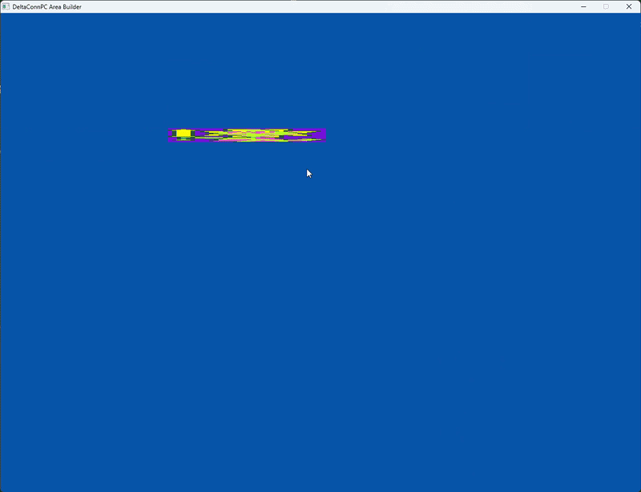
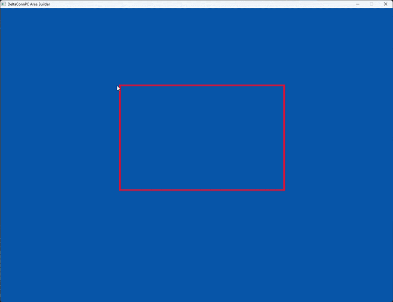

## Devlog #4 - 7/16/2026
# Moving Pictures (And storing them!)

#### Let's hope they're visible by the camera eye.

Today, I actually got a lot working, even though it didn't feel like much to me. I added the ability to move and change the size of hitboxes and image boxes; I added a image-file-path storage system and functions to deal with it; biggest of all, I finished the file-exporting function!!!

## Scaling Pictures, Too!

Now, you can grab an image box's edge and change its size and shape. The part of its edge you grab matters; if you grab the middle of an edge, you'll only change its size along that axis because you've only got the edge in hand; if you grab a corner, you'll change its size along both axes.


This works exactly the same way with hitboxes, as you could probably imagine.


I will add the ability to drag the boxes around next time; I noticed that one can basically drag something with just the stretching tools I made... HOWEVER, it'd be the most annoying thing ever, so I will add the dragging lol.

## Advanced Path-Filing

I made a `struct` for storing filepaths and made some cool functions for it. I'm not sure how to explain it well, so here it is:
```c
// ALL IMAGES MUST HAVE FILE PATHS ACCESSIBLE IN THE PROJECT FOLDER OR SHIT WILL BREAK
const int MAX_IMAGES = 32;
typedef struct {
    char** paths;
    int pathCount;
} FilePaths;

bool initLoadMemory(FilePaths* pl) {
    if (!pl) return false;

    memset(pl, 0, sizeof(*pl));
    pl->paths = calloc(MAX_IMAGES, sizeof(char*));
    if (pl->paths == NULL) return false;
    return true;
}
bool cleanLoadMemory(FilePaths* pl) {
    if (!pl) return false;

    for (int i = 0; i < pl->pathCount; i++) free(pl->paths[i]);
    free(pl->paths);
}
bool addFilePath(FilePaths* pl, const char* newPath) {
    if (pl->pathCount >= 32) return false;

    pl->paths[pl->pathCount] = strdup(newPath);
    if (pl->paths[pl->pathCount] == NULL) return false;

    pl->pathCount++;
    return true;
}
```

Basically, it adds the filepath to the list and makes sure no bad memory problems happen. I like C because you can shoot yourself in the foot.

## File-Exporting Function

I finished the file-exporting function!!! It's very big; 67 lines long, in fact. <small><small>Don't say it.</small></small>  
Its data look like this once printed:
```
fp,C:\Users\me\Pictures\Screenshots\Screenshot 2026-07-13 155539.png
hb,i,529.00,165.00,261.00,456.00
ib,00,321.00,266.00,569.00,286.00

```


What I haven't done yet is write a reverse function; that is, a parser of this kind of data file. But this function is really cool, I think, because it looks cool. Here it is in its full "glory":
```c
bool exportLevelFile(FilePaths* fp) {
    const int bytesPerHitbox = 4*8 + 2; // ",t" + 4x ",0000.00"
    const int bytesPerImageBox = 8*8 + 3; // ",00" + 4x ",0000.00"


    int filePathsSize = 0;
    for (int i = 0; i < fp->pathCount; i++) filePathsSize += strlen(fp->paths[i]) + 1;
    //                                            "fp" + filepaths
    char* filePathStrs = (char*)calloc(2 + filePathsSize, sizeof(char));
    if (filePathStrs == NULL) return false;
    
    strcpy(filePathStrs, "fp");
    filePathsSize = 0;
    for (int i = 0; i < fp->pathCount; i++) {
        strcat(filePathStrs, ",");
        strcat(filePathStrs, fp->paths[i]);
    }


    
    //                                          "hb"   +   hitbox encoding
    char* hitboxStrs = (char*)calloc(2 + hitboxesFull*bytesPerHitbox, sizeof(char));
    if (hitboxStrs == NULL) return false;
    strncpy(hitboxStrs, "hb", 2);

    for (int i = 0; i < hitboxesFull; i++) {
        const Hitbox h = hitboxes[i];

        char* type = "";
        if (h.typ == SOLID) type = "s"; if (h.typ == TRANSITION) type = "t"; if (h.typ == INTERACT) type = "i";

        const char* coordinates = TextFormat(",%s,%04.02f,%04.02f,%04.02f,%04.02f", type, h.x, h.y, h.w, h.h);
        strncat(hitboxStrs, coordinates, bytesPerHitbox);
    }

    
    //                                            "ib"    +    imagebox encoding
    char* imageBoxStrs = (char*)calloc(2 + imageboxesFull*bytesPerImageBox, sizeof(char));
    if (imageBoxStrs == NULL) return false;
    strncpy(imageBoxStrs, "ib", 2);

    for (int i = 0; i < imageboxesFull; i++) {
        const ImageBox ib = imageboxes[i];

        const char* coordinates = TextFormat(",%02i,%04.02f,%04.02f,%04.02f,%04.02f", ib.fileIndex, ib.x, ib.y, ib.w, ib.h);
        strncat(imageBoxStrs, coordinates, bytesPerImageBox);
    }


    // write everything to the file
    FILE* writeFile;
    writeFile = fopen("./abc.txt", "w");
    if (writeFile == NULL) return false;

    fprintf(writeFile, "%s\n%s\n%s\n\0", filePathStrs, hitboxStrs, imageBoxStrs);
    fclose(writeFile);


    // after combining and saving
    free(hitboxStrs);
    free(imageBoxStrs);
    free(filePathStrs);
    if (hitboxStrs != NULL || imageBoxStrs != NULL || filePathStrs != NULL) return false;
    return true;
}
```

