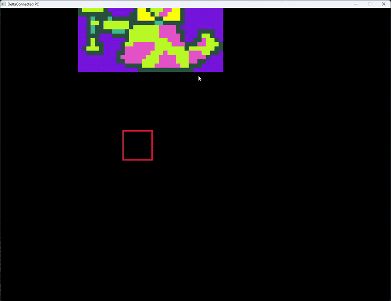
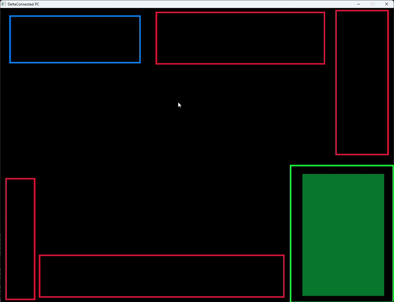

## Devlog #5 - 7/20/2026
# Another Medium

#### I'm getting to the CORE of the project now.

So I've done all this stuff for a level builder. Hoo- cares...? People need to be able to PLAY the game, no? Well, today I work on THE ACTUAL GAMEPLAY.  
From now on, most of my coding will be about the gameplay side of things. Awesome.

## Playing the Game

The first thing I did to make gameplay happen was to add hitbox collision! Every game where you can move around needs that. I wrote all of the code for it without testing and it worked first-try! I was shocked.

## Parsing

I made that helpful function last time that encodes the level data into a text file. Now, I need a function that reads that and loads it in for players to play in and interact with. That's the first thing I did today, and here's what it looks like!

Doesn't that look like a plentiful level! What interesting activities that Floradinn would be able to partake in were his size not so obstructive...  
To be honest, this function technically took me TWO days to write. I spent the 19th watching the World Cup (GO SPAIN!!!) so it's the 20th now. I finally found the bug messing up the function: I DIDN'T MOVE ON TO THE NEXT DATUM IN THE WHILE LOOP.  
Super dumb. But whatever, it works now!